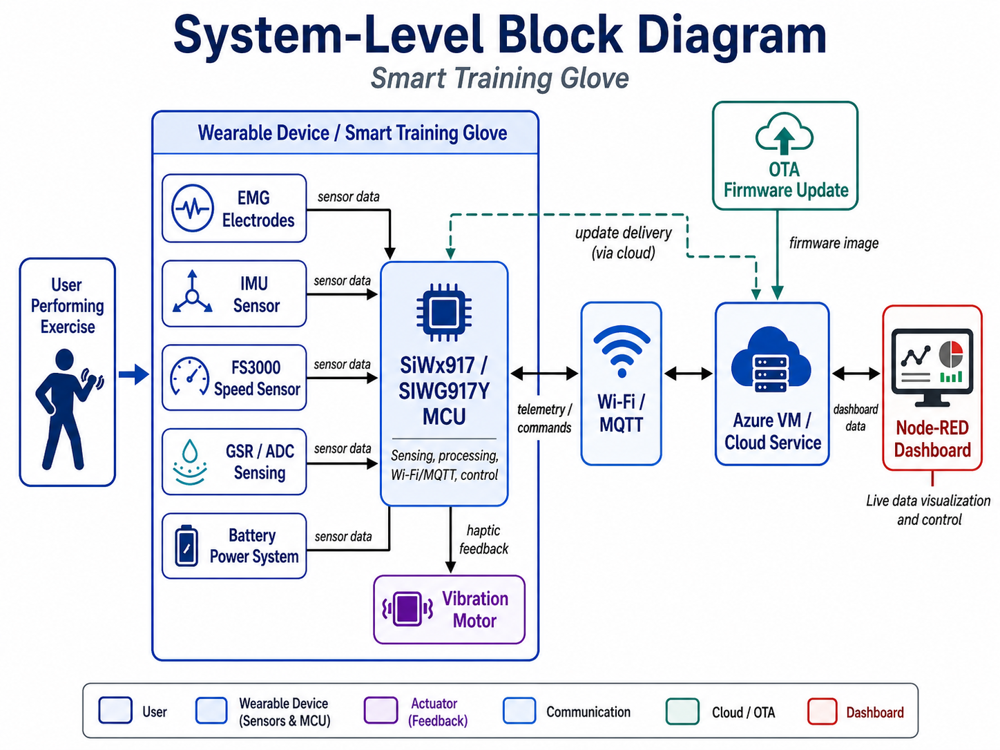
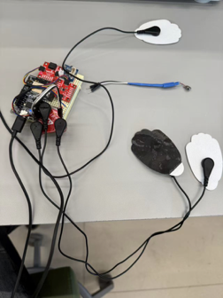
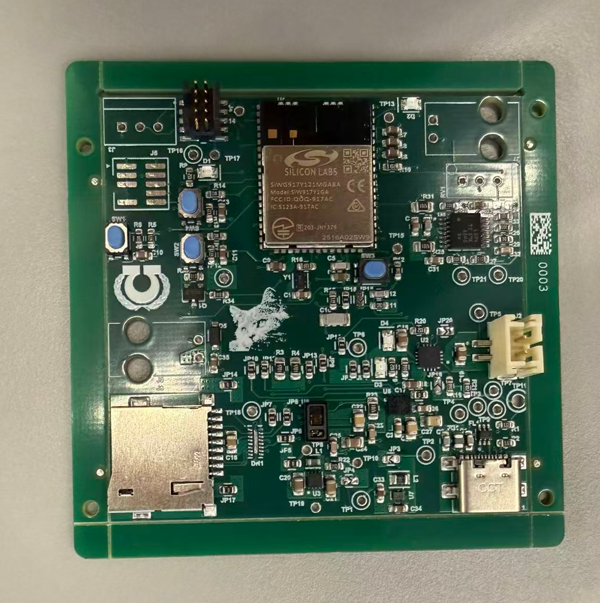
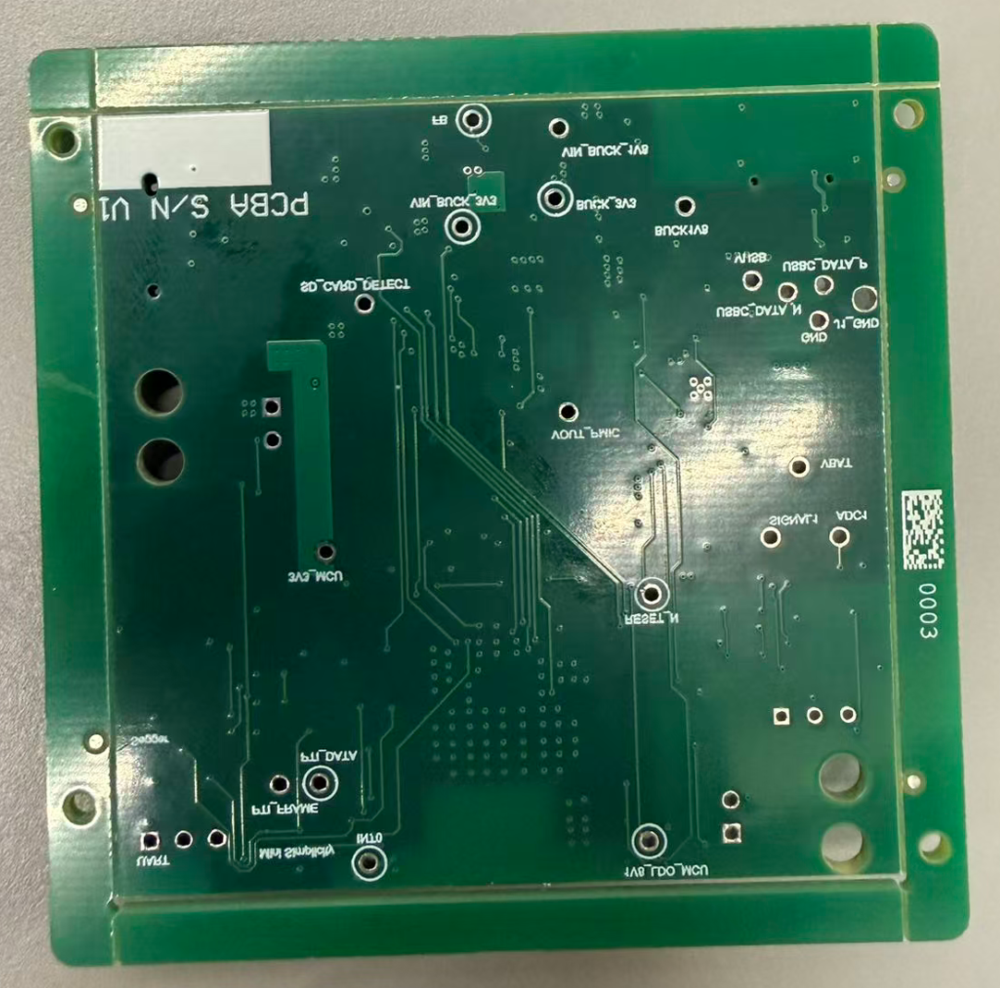
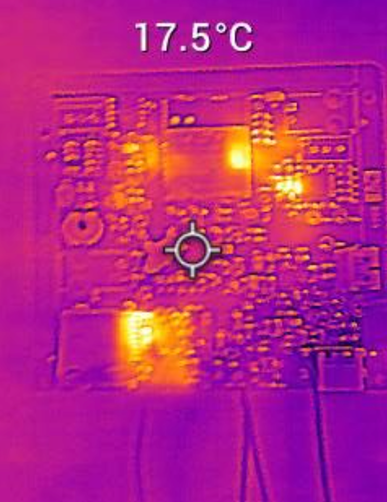
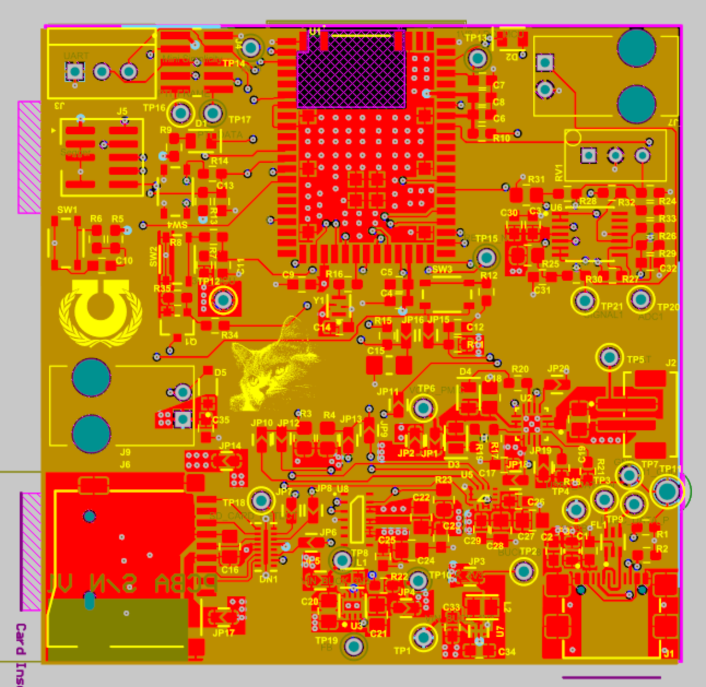
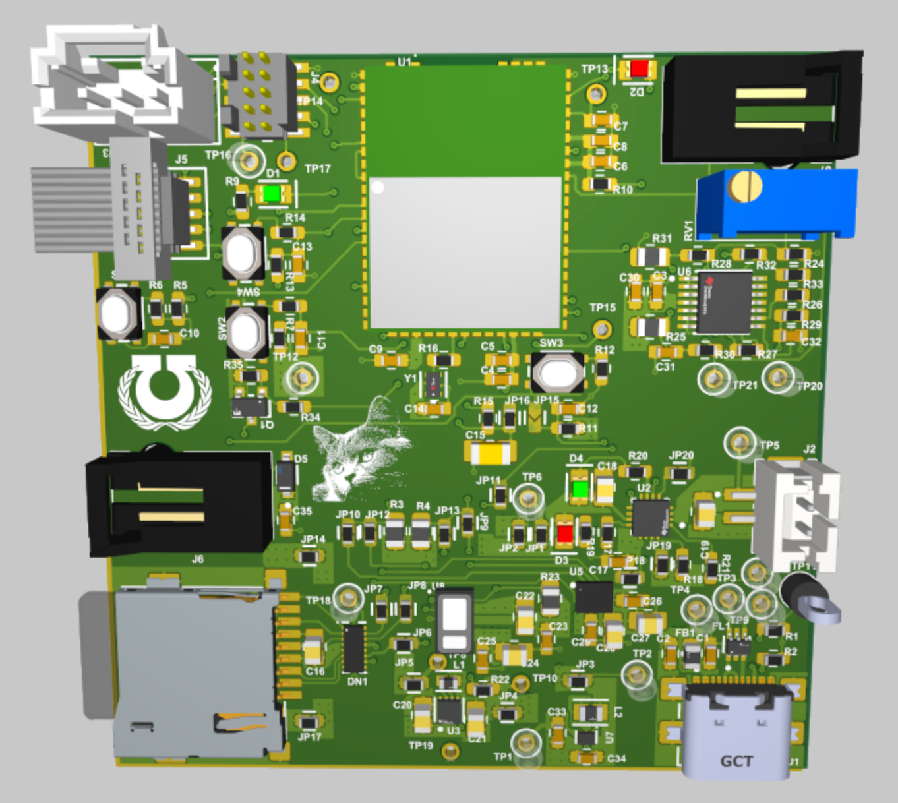
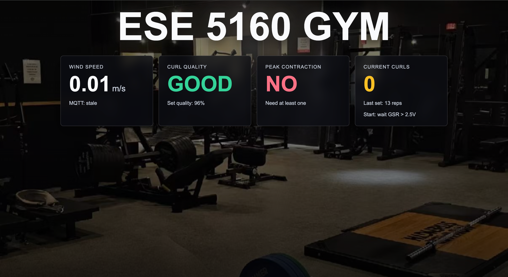
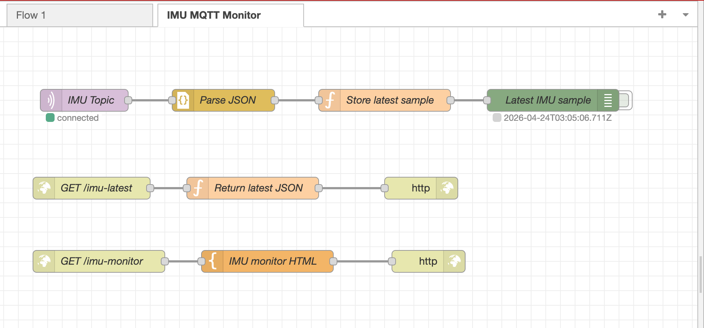

# a11g-final-submission

**Team Number:** T13

**Team Name:** UltraMCU

| Team Member Name | Email Address | GitHub Username |
| ---------------- | ------------- | --------------- |
| Runhuan Chen | runhuan@seas.upenn.edu | chenr4  |
| Siwei Lei   | laialex@seas.upenn.edu | Alex-lei-1  |

**GitHub Repository URL:** https://github.com/ese5160/a11g-final-submission-s26-s26-t13-ultramcu.git

## 1. Video Presentation

## 2. Project Summary

### 2.1 Device Description

Our device is a smart training glove that provides real-time feedback during strength-training exercises. It uses motion, muscle-activation, speed, and physiological sensing to detect exercise quality and gives haptic feedback when the user’s form needs correction.

We chose this project because many people perform repetitive strength-training movements with poor form, especially when they become tired or rely on momentum. The glove acts as a wearable coach by giving immediate feedback during the exercise instead of only reviewing performance afterward.

The Internet connection allows the glove to publish live sensor data and workout status to a Node-RED dashboard through Wi-Fi and MQTT. This makes the system easier to monitor, debug, and control remotely during training.

### 2.2 Device Functionality

The smart training glove is built around a SiWx917 / SIWG917Y-based embedded platform. The device collects sensor data, processes the workout state, sends telemetry to the cloud dashboard, and controls a vibration motor for haptic feedback.

| Part | Function |
|---|---|
| SiWx917 / SIWG917Y platform | Main controller, Wi-Fi, MQTT communication, and firmware execution |
| EMG electrodes | Detect muscle activation and peak effort |
| IMU sensor | Measure hand motion for curl phase detection and rep counting |
| FS3000 speed sensor | Help detect fast lowering or momentum-based movement |
| GSR / ADC sensing | Provide additional physiological context |
| Vibration motor | Give haptic feedback when form correction is needed |
| Battery power system | Support portable wearable operation |
| Node-RED dashboard | Display live data and send control commands |
| Azure VM | Host the cloud dashboard and MQTT communication service |

**System-Level Block Diagram**

### 2.3 Challenges

One of the main challenges was bringing up the custom PCBA. The board could not always be flashed reliably through the external J-Link debugger, and Commander sometimes failed during the flashloader stage. This made firmware development harder because the target board could become unstable after failed programming attempts.

To debug this issue, we checked the board step by step, including power stability, reset behavior, SWDIO/SWCLK signals, oscillator operation, debugger wiring, and device provisioning state. This helped us understand that custom board bring-up requires both hardware-level debugging and firmware/programming-flow debugging.

We also faced integration challenges when combining sensors, actuator control, Wi-Fi/MQTT communication, Node-RED dashboard communication, and OTA firmware update into one system. We handled this by testing each subsystem separately first, then using CLI printouts, simple test firmware, and incremental integration to verify the full prototype.

### 2.4 Prototype Learnings

This project taught us that a successful IoT prototype is a complete system, not just a PCB or a firmware program. Hardware, embedded software, wireless communication, cloud infrastructure, power, and physical construction all need to work together reliably.

We learned that integration is usually harder than testing individual parts. A sensor, motor, Wi-Fi connection, or dashboard may work alone, but the final prototype depends on how well all of these components interact.

We also learned the importance of designing for debugging. Serial logs, simple test firmware, dashboard feedback, and staged validation helped us identify whether a problem came from hardware, firmware, networking, or cloud setup.

If we built this device again, we would add more hardware test points, improve the programming/debug interface, organize the firmware modules earlier, and design the glove enclosure earlier in the project.

### 2.5 Next Steps & Takeaways

The next step is to improve the smart training glove from a working prototype into a more reliable and wearable training system.

| Improvement | Purpose |
|---|---|
| Better EMG calibration | Improve muscle activation detection |
| Improved IMU processing | Make rep counting and curl phase detection more accurate |
| More reliable speed-sensing validation | Better detect fast lowering and momentum-based movement |
| Cleaner wearable enclosure | Make the glove easier to wear and demonstrate |
| Battery monitoring | Track portable power status |
| Cloud data logging | Store workout history for later review |
| Improved dashboard UI | Make live feedback easier to understand |

Through ESE5160, we learned how to design and build an Internet-connected embedded system from concept to prototype. The project gave us hands-on experience with PCB design, board bring-up, embedded firmware, sensor integration, Wi-Fi, MQTT, OTA firmware updates, Azure VM deployment, Node-RED dashboards, and system-level debugging.

The main takeaway is that IoT prototyping requires system-level thinking. A good final device depends on the interaction between hardware, firmware, cloud backend, user interface, power system, and physical design.

### 2.6 Project Links

[Public_link](https://chenr4.github.io/ESE516_smart_glove/)

## 3. Hardware & Software Requirements

Each requirement was reviewed based on the final prototype, board bring-up results, firmware tests, Node-RED dashboard behavior, and system integration progress. Some requirements were fully met, while others were partially met due to custom PCBA flashing and final integration limitations.

### 3.1 Hardware Requirements Review

| ID | Requirement | Validation Method | Result | Status |
|---|---|---|---|---|
| HRS-01 | Use a SiWx917 / SIWG917Y-based embedded platform as the main controller. | Visual inspection, firmware testing, and board bring-up. | The SiWx917-based platform was used as the main controller for sensing, Wi-Fi/MQTT communication, and actuator control. Custom PCBA bring-up was attempted, but flashing was not fully reliable. | Partial |
| HRS-02 | Support portable battery-powered operation. | Checked power architecture and battery input design. | The system was designed to support portable operation through a battery power system. | Met |
| HRS-03 | Provide a stable 3.3 V power rail. | Measured the 3.3 V rail with a multimeter. | The 3.3 V rail was measured around 3.2–3.3 V and remained stable during testing. | Met |
| HRS-04 | Include a 1.8 V power rail for low-voltage components. | Checked schematic/layout and verified the regulator design. | The 1.8 V rail was included in the hardware design. | Met |
| HRS-05 | Support Wi-Fi communication. | Tested Wi-Fi connection and cloud communication flow. | Wi-Fi was used to communicate with the Azure VM and Node-RED dashboard. | Met |
| HRS-06 | Include an IMU for motion sensing. | Checked sensor connection and motion-related readings. | The IMU was included for hand motion sensing, curl phase detection, and rep-counting logic. | Met |
| HRS-07 | Include EMG sensing for muscle activation. | Checked electrode connection and observed EMG-related signal behavior. | EMG electrodes were included to detect muscle activation and peak effort, but calibration needs further improvement. | Met |
| HRS-08 | Include FS3000 speed sensing. | Checked sensor connection and observed speed-related readings. | The FS3000 sensor was included to help detect fast lowering or momentum-based movement. | Met |
| HRS-09 | Include GSR / ADC sensing. | Checked ADC input and observed sensor value changes. | GSR/ADC sensing was included to provide additional physiological context. | Met |
| HRS-10 | Include a vibration motor for haptic feedback. | Triggered the motor through firmware or dashboard control. | The vibration motor provided short or long haptic feedback cues. | Met |
| HRS-11 | Include basic user/debug interfaces. | Tested LED/button behavior through firmware or dashboard commands. | Debug LED and button interfaces were used during development and testing. | Met |
| HRS-12 | Integrate the electronics into a wearable glove prototype. | Visual inspection and final prototype demonstration. | The sensors, controller, and haptic motor were integrated into a smart training glove prototype, but the physical mounting could be improved. | Met |

### 3.2 Software Requirements Review

| ID | Requirement | Validation Method | Result | Status |
|---|---|---|---|---|
| SRS-01 | Initialize required peripherals after boot. | Checked firmware initialization and CLI/debug output. | Basic initialization was implemented for the main peripherals, but not every sensor was fully validated in the final integrated system. | Met |
| SRS-02 | Connect to a configured Wi-Fi access point. | Observed serial output and cloud connection behavior. | The device connected to Wi-Fi for cloud communication. | Met |
| SRS-03 | Connect to the MQTT service on the cloud VM. | Observed MQTT messages and Node-RED communication. | MQTT communication with the VM-hosted Node-RED system was implemented and tested. | Met |
| SRS-04 | Publish telemetry and workout status to MQTT topics. | Checked MQTT messages and dashboard display. | The system published live sensor-related data and workout status to the Node-RED dashboard. | Met |
| SRS-05 | Subscribe to cloud command topics. | Sent commands from Node-RED and observed device response. | The device could receive dashboard commands for outputs such as LED or haptic feedback. | Met |
| SRS-06 | Display live data on the Node-RED dashboard. | Opened the dashboard and checked widgets. | The dashboard displayed device information, sensor-related data, and workout status. | Met |
| SRS-07 | Allow user control from the dashboard. | Used dashboard buttons/switches and observed device behavior. | Node-RED controls were used to send commands back to the embedded device. | Met |
| SRS-08 | Use IMU data for motion analysis. | Tested glove motion and observed state/rep behavior. | IMU-based motion sensing was used for curl phase and rep-counting logic, but accuracy could be improved. | Met |
| SRS-09 | Use EMG data for muscle activation detection. | Observed EMG-related signal behavior during activation. | EMG sensing was included, but signal quality and calibration need more work. | Met |
| SRS-10 | Use FS3000 data for speed or momentum feedback. | Observed sensor behavior during controlled movement. | FS3000 sensing was included, but the final detection logic needs more validation. | Met |
| SRS-11 | Use GSR/ADC data as physiological context. | Observed ADC/sensor value changes during testing. | GSR/ADC sensing was included as an additional context signal. |    Met |
| SRS-12 | Control vibration motor feedback. | Triggered motor output from firmware or Node-RED. | The motor provided haptic feedback for form correction and device feedback. | Met |
| SRS-13 | Support OTA firmware update. | Hosted firmware on the server and tested the OTA update flow. | OTA firmware update was demonstrated through the Internet update workflow. | Met |
| SRS-14 | Organize firmware into clear modules. | Reviewed code structure and integration flow. | Firmware behavior was organized around sensing, communication, control, and system status. | Met |
| SRS-15 | Handle communication or peripheral errors gracefully. | Observed system behavior during debugging and integration. | Basic debug output and staged testing were used, but full fault-tolerance validation was not completed. | Met |

## 4 Project Photos & Screenshots

This section shows the final prototype, custom PCBA, system dashboard, and design screenshots used to document the completed smart training glove system.

- **Your final project**

- **The standalone PCBA, top**

- **The standalone PCBA, bottom**

- **Thermal camera images while the board is running under load**

- **The Altium Board design in 2D view**

- **The Altium Board design in 3D view**

- **Node-RED dashboard**

- **Node-RED backend**

## 5. Codebase

The source code for this project is stored in the separate firmware repository used during development. This GitHub Pages repository only provides project documentation and links to the required codebases.

| Required Item | Link |
|---|---|
| Final Embedded C Firmware Codebase | [Embedded Firmware](https://github.com/ese5160/final-project-firmware-s26-t13-ultramcu) |
| Node-RED Dashboard Code | [Node-RED Flow](https://github.com/ese5160/final-project-firmware-s26-t13-ultramcu/blob/main/Node-RED/flows.json) |
